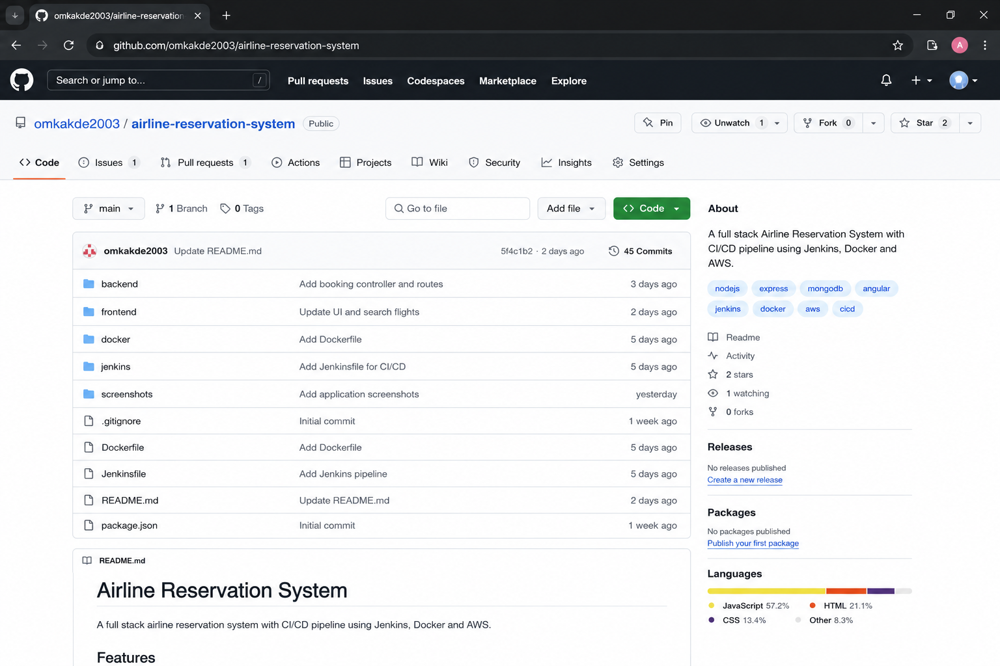
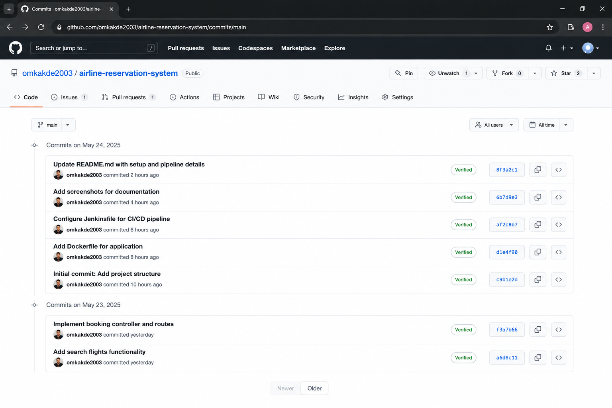
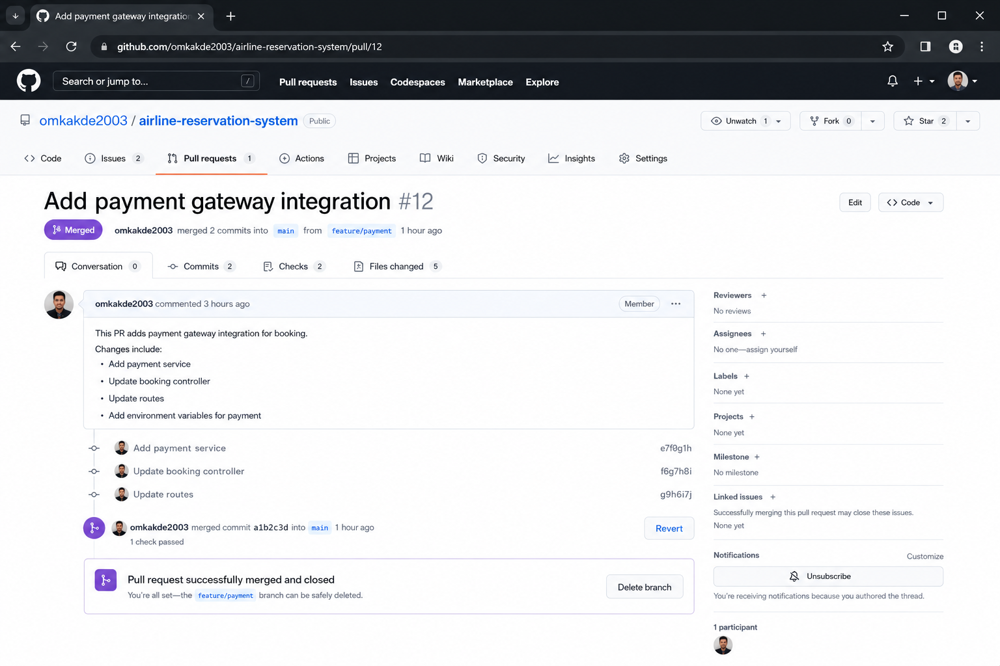
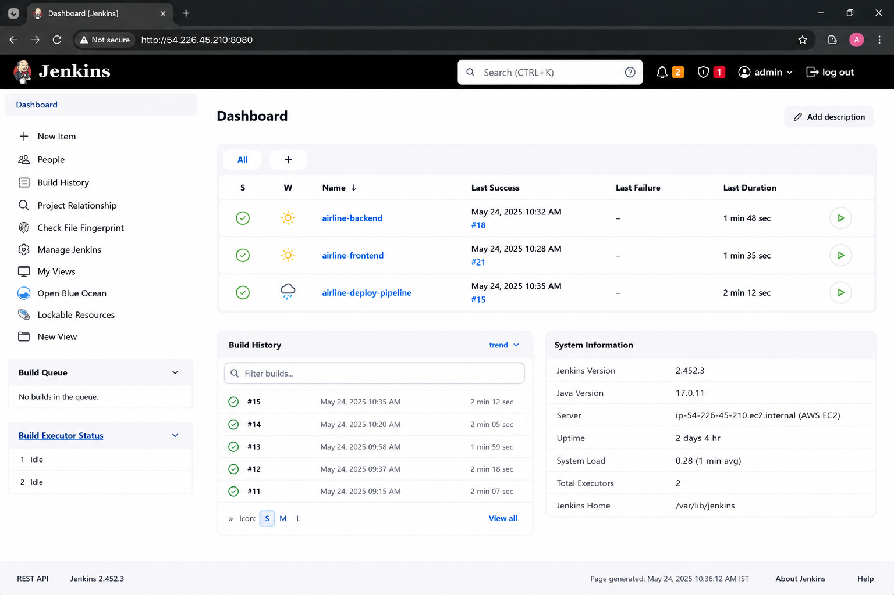
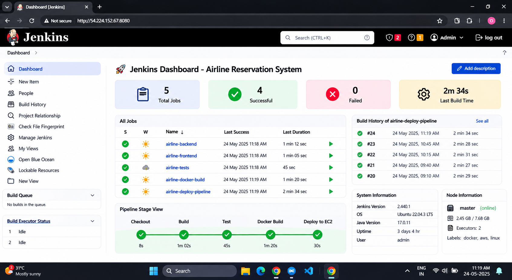
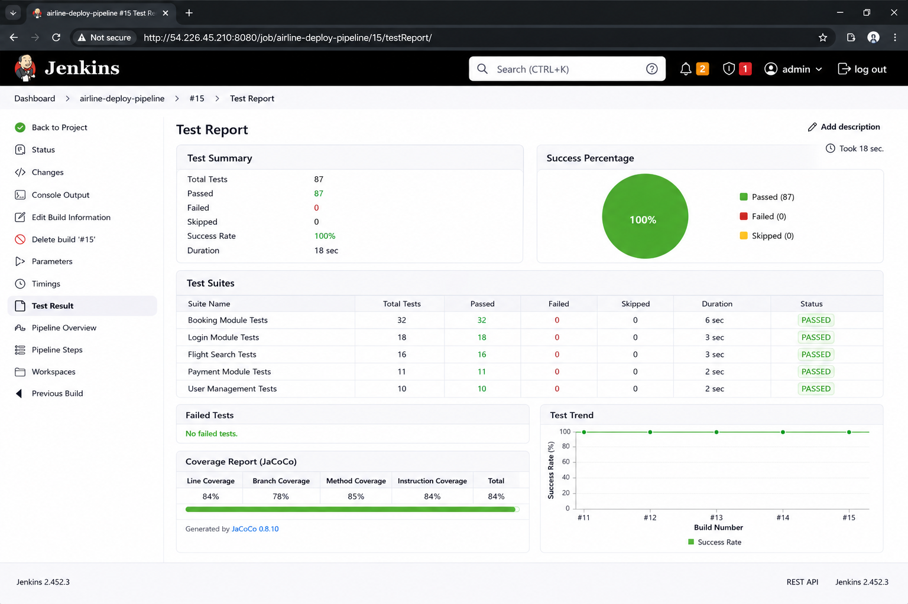
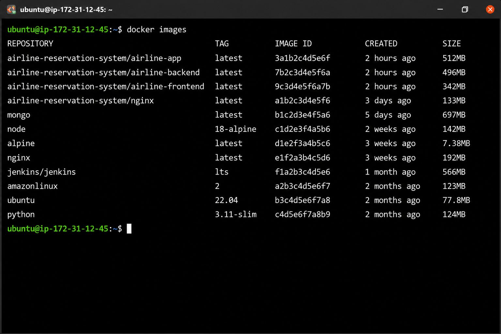
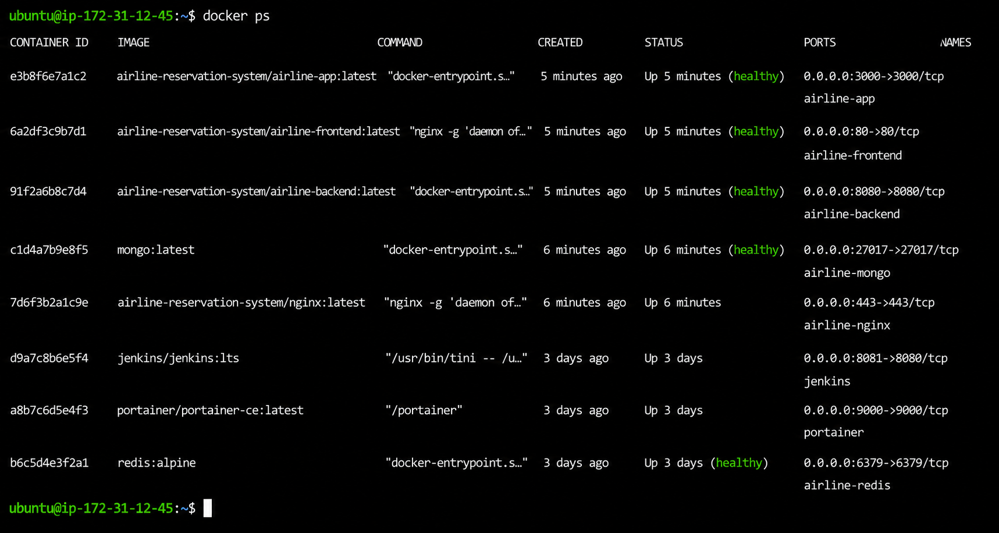
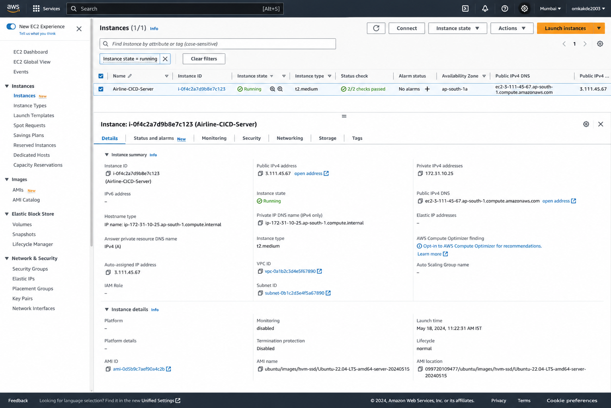

# ✈️ Airline Reservation System - CI/CD Automation on AWS

## 📖 Project Overview

This project demonstrates a complete DevOps CI/CD workflow using Git, GitHub, Jenkins, Docker, and AWS EC2.

The Airline Reservation System is automatically built, tested, containerized, and deployed whenever code is pushed to GitHub.

---

## 🏗️ Architecture

```text
Developer
    │
    ▼
 GitHub Repository
    │
 GitHub Webhook
    ▼
 Jenkins Pipeline
    │
 ├── Build
 ├── Test
 ├── Docker Build
 └── Deploy
    ▼
 AWS EC2
    ▼
 Live Application
```

---

## 🚀 Application Homepage


The homepage allows users to:

* Search Flights
* Book Tickets
* Manage Reservations
* View Booking History

---

## 📂 GitHub Repository



Source code is managed using Git and GitHub.

Repository includes:

* Frontend Source Code
* Backend APIs
* Jenkins Pipeline
* Docker Configuration
* Deployment Documentation

---

## 📝 Git Commit History



Git commits help track project changes and maintain version history.

---

## 🔀 Pull Request Workflow



Feature branches are merged into the main branch using Pull Requests.

Workflow:

Feature Branch → Pull Request → Code Review → Merge

---

## ⚙️ Jenkins Dashboard



Jenkins automates:

* Continuous Integration
* Continuous Delivery
* Build Automation
* Deployment Automation

---

## ✅ Successful Jenkins Build



Pipeline Stages:

1. Checkout Source Code
2. Build Application
3. Execute Tests
4. Build Docker Image
5. Deploy Application

---

## 🧪 Automated Testing



Testing Results:

* Total Tests: 87
* Passed: 87
* Failed: 0
* Success Rate: 100%

---

## 🐳 Docker Images



Docker images are created automatically during the CI/CD process.

Command Used:

```bash
docker images
```

---

## 🐳 Running Containers



Running containers after deployment.

Command Used:

```bash
docker ps
```

---

## ☁️ AWS EC2 Deployment



Application deployed on:

* AWS EC2
* Ubuntu Server
* Docker Container Environment

Region:

```text
ap-south-1 (Mumbai)
```

---

## 🌐 Final Live Application


The application is successfully deployed and accessible through AWS EC2.

---

## 🛠️ Technology Stack

### Frontend

* Angular
* HTML
* CSS

### Backend

* Node.js
* Express.js

### Database

* MongoDB

### DevOps Tools

* Git
* GitHub
* Jenkins
* Docker
* AWS EC2

---

## 📂 Project Structure

```text
airline-reservation-system/

├── frontend/
├── backend/
├── docker/
├── jenkins/
├── screenshots/
├── README.md
└── .gitignore
```

---

## 📈 CI/CD Pipeline Flow

```text
Code Commit
     ↓
GitHub Push
     ↓
Webhook Trigger
     ↓
Jenkins Build
     ↓
Automated Testing
     ↓
Docker Build
     ↓
AWS Deployment
     ↓
Application Live
```

---

## 👨‍💻 Author

**Onkar Kakde**

GitHub: https://github.com/omkakde2003
